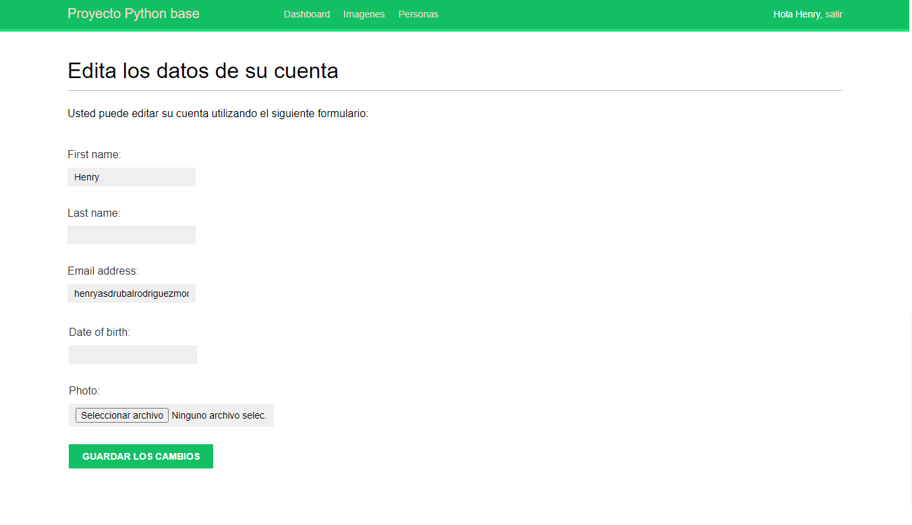

# proyecto Python

Es un desarrollo que permite logearse, cambiar contraseña y recuperar contraseña mediante correo electronico.





### Ejecución


```
Ejecutar --> Python manage.py

```

## Estructura

- Templates, Todas vistas HTML


